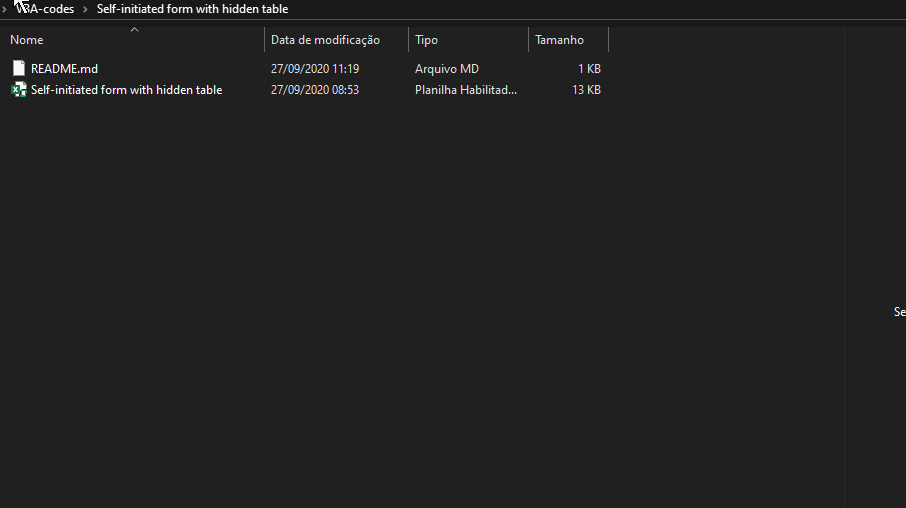

### What this code should do
Start the form by opening the file and hiding the data table.



### Code in the file

```VBA
Private Sub Workbook_Open()

    'This line hides the table
    Application.Visible = False
    
    'This line starts the form with the opening of the file
    UserForm1.Show
    
End Sub
```

### Useful links
* [Workbook_Open](https://docs.microsoft.com/pt-br/office/vba/api/excel.workbook.open)
* [Application.Visible](https://docs.microsoft.com/pt-br/office/vba/api/excel.application.visible)
* [Show-method](https://docs.microsoft.com/pt-br/office/vba/language/reference/user-interface-help/show-method)
